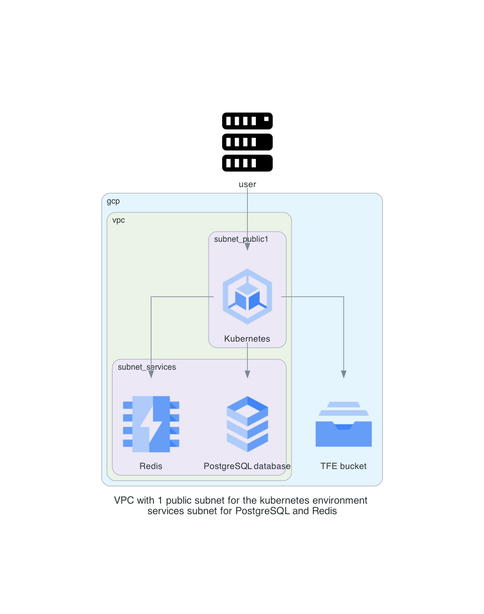

# Terraform Enterprise FDO - External on Google Cloud Platform

This is a repository to have a TFE FDO with kubernetes on GCP. This is using a PostgreSQL, Redis and a bucket from GCP. 

# Diagram

  

# Prerequisites

## License
Make sure you have a TFE license available for use

## GCP

Have your GCP credentials configured

```
gcloud config set account <your account>
gcloud auth activate-service-account --key-file=key.json
gcloud config set project <your project>
export USE_GKE_GCLOUD_AUTH_PLUGIN=True      # needed to work correctly with kubectl and getting credentials later
```

#### API enabled for
- Service Networking API
- Cloud SQL admin API
- Google Cloud Memorystore for Redis API
- Kubernetes Engine API

#### Following roles assigned to your account
- Compute Network Admin
- Compute Storage Admin
- Editor
- Project IAM Admin
- kubernetes engine admin
- kubernetes engine cluster admin


## AWS

This repository uses AWS resources for the DNS resources and creating the DNS records

## Install terraform  
See the following documentation [How to install Terraform](https://learn.hashicorp.com/tutorials/terraform/install-cli)

## TLS certificate
You need to have valid TLS certificates that can be used with the DNS name you will be using to contact the TFE instance.  
  
The repo assumes you have no certificates and want to create them using Let's Encrypt and that your DNS domain is managed under AWS. 

## kubectl
Make sure kubectl is available on your system. Please see the documentation [here](https://kubernetes.io/docs/tasks/tools/).

## helm
Make sure helm is available on your system. Please see the documentation [here](https://helm.sh/docs/intro/install/)

# How to

- Clone the repository to your local machine
```sh
git clone https://github.com/munnep/tfe_fdo_gcp_external_kubernetes.git
```
- Add your gcp authentication key as `key.json` to the root directory of the repository

## Now you will need to create the infrastructure for Kubernetes
- Go to the directory  
```sh
cd tfe_fdo_gcp_external_kubernetes/infra
```
- create a file called `variables.auto.tfvars` with the following contents and your own values
```
# General
tag_prefix        = "tfe29"                       # TAG prefix for names to easily find your AWS resources
# gcp
gcp_region        = "europe-west4"                # GCP region creating the resources
vnet_cidr         = "10.214.0.0/16"               # Network to be used
gcp_project       = "hc-ff9323d13b0e4e0da8171"    # GCP project id (found in keys.json)
gcp_location      = "EU"                          # location to create SQL and bucket 
rds_password      = "Password#1"                  # password used for PostgreSQL
```
- Terraform initialize
```
terraform init
```
- Terraform plan
```
terraform plan
```
- Terraform apply
```
terraform apply
```
- Terraform output should create 18 resources and show outputs used by the next steps
```
Plan: 18 to add, 0 to change, 0 to destroy.

Outputs:

Outputs:

cluster-name = "tfe29-gke-cluster"
gcp_location = "EU"
gcp_project = "hc-fbb4ffd7539b49348762f97a2ea"
gcp_region = "europe-west4"
google_bucket = "tfe29-bucket"
kubectl_environment = "gcloud container clusters get-credentials tfe29-gke-cluster --region europe-west4"
pg_address = "10.140.1.3"
pg_dbname = "tfe"
pg_password = <sensitive>
pg_user = "admin-tfe"
prefix = "tfe29"
redis_host = "10.140.0.3"
redis_port = 6379
```
- You can now login to the application with the username `admin` and password specified in your variables.

## Now you will need to deploy Terraform Enterprise on to this cluster

- Go to the directory `../tfe`
```
cd ../tfe
```
- Create a file called `variables.auto.tfvars` with the following contents
```
dns_hostname               = "tfe29"                                   # Hostname used for TFE
dns_zonename               = "aws.munnep.com"                          # DNS zone where the hostname record can be created
certificate_email          = "patrick.munne@hashicorp.com"             # email address used for creating valid certificates
tfe_encryption_password    = "Password#1"                              # encryption key used by TFE
tfe_license                = "02MV4UU43BK5HGYYTOJZ"                    # TFE license as a string
replica_count              = 1                                         # Number of replicas for TFE you would like to have started
tfe_license                = "<your_tfe_license_raw_text>"             # Your TFE license in raw text
tfe_release                = "v202312-1"                               # The version of TFE application you wish to be deployed   
# AWS
region                     = "eu-north-1"                              # To create the DNS record on AWS          
```
- Initialize the environment
```
terraform init
```
- Create the environment
```
terraform apply
```
- This will create 7 resources
```
Apply complete! Resources: 7 added, 0 changed, 0 destroyed.

Outputs:

execute_script_to_create_user_admin = "./configure_tfe.sh tfe29.aws.munnep.com patrick.munne@hashicorp.com Password#1"
tfe_application_url = "https://tfe29.aws.munnep.com"
```
- Execute the `configure_tfe.sh tfe11.aws.munnep.com patrick.munne@hashicorp.com Password#1` script to do the following
  - Create a user called admin with the password specified
  - Create an organization called test
- login to the application on url https://tfe29.aws.munnep.com

# TODO

# DONE
- [x] build network according to the diagram
- [x] create kubernetes
- [x] Create redis
- [x] create PostgreSQL instance
- [x] create a bucket
- [x] Create a valid certificate to use 
- [x] install TFE using helm chart
- [x] point dns name to loadbalancer 